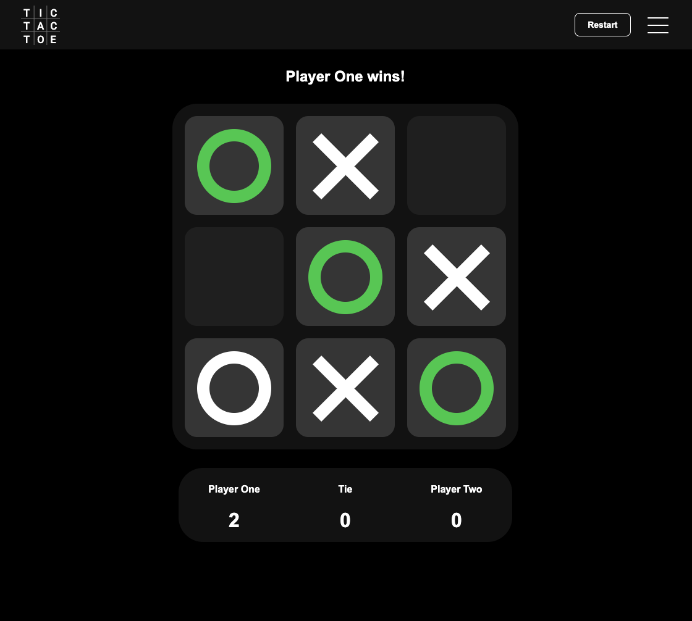

# Tic Tac Toe

Tic Tac Toe is a browser-based game with local, AI, and online multiplayer modes. It supports classic 3x3 play, a larger 4x4 board, selectable token themes, persisted local scores, and Firebase-backed online rooms that can be shared with another player by URL.

[Play the game](https://ryan-xin.github.io/tictactoe/)



## How It Works

The app is a static HTML, CSS, and JavaScript project. The game UI is rendered from `index.html`, styled by `css/style.css`, and driven by `js/main.js`.

Local play and AI mode run entirely in the browser. Local scores, selected options, and board state are saved with `localStorage` so the current session can survive a page reload.

Online mode uses Firebase Anonymous Auth and Firestore. One player creates a room, the app writes the room ID into the URL as a `?game=` query parameter, and another player can join the same room from that shared link. Firestore rules enforce the basic room and move boundaries.

## Main Features

- Local two-player Tic Tac Toe.
- AI opponent mode.
- Online rooms with reusable share links.
- 3x3 and 4x4 board options.
- Two selectable token themes.
- Restart current round without clearing scores.
- Start a new game and clear current results.
- Persist local game state with `localStorage`.

## Project Structure

- `index.html` - static page markup and Firebase client configuration.
- `css/style.css` - app layout, board, menu, and modal styles.
- `js/main.js` - game state, local play, AI play, online room sync, and UI events.
- `assets/` - logo, token SVGs, menu icons, and screenshot.
- `firestore.rules` - Firestore security rules for online rooms.
- `docs/firebase-online-mode.md` - Firebase setup and manual online-mode verification.

## Run Locally

Serve the static files from the repo root:

```sh
python3 -m http.server 8000
```

Then open:

```text
http://localhost:8000
```

## Online Mode / Firebase

Online mode requires Firebase Anonymous Auth, Firestore, and the rules in `firestore.rules`. Follow [Firebase Online Mode Setup](docs/firebase-online-mode.md) for project setup and manual verification steps.

## Deployment

The app is deployed as static files on GitHub Pages:

```text
https://ryan-xin.github.io/tictactoe/
```

For Firebase-backed online mode, deploy Firestore rules after changing `firestore.rules`:

```sh
firebase deploy --only firestore:rules
```
